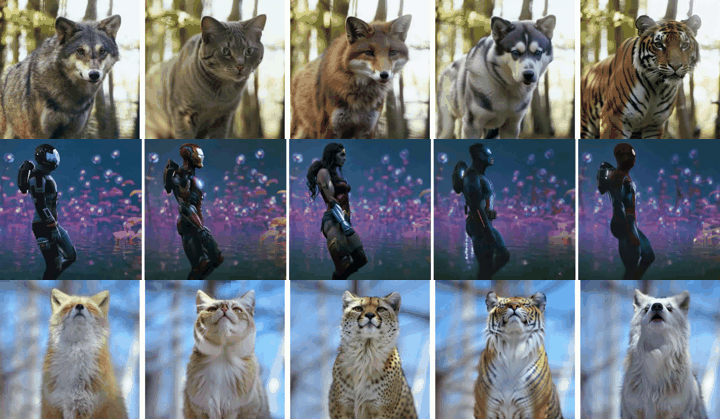

# VideoDirector: Precise Video Editing via Text-to-Video Models (CVPR2025)
## [<a href="https://yukun66.github.io/VideoDirector/" target="_blank">Project Page</a>]

**[VideoDirector: Precise Video Editing via Text-to-Video Models](https://arxiv.org/abs/2411.17592)** 
</br>
Yukun Wang, 
Longguang Wang, 
Zhiyuan Ma, 
Qibin Hu, 
Kai Xu, 
Yulan Guo (✝Corresponding Author)  

[](https://arxiv.org/abs/2411.17592) 


[//]: # ([![Replicate]&#40;https://replicate.com/cjwbw/multidiffusion/badge&#41;]&#40;https://replicate.com/cjwbw/multidiffusion&#41;)

[//]: # ([![Hugging Face Spaces]&#40;https://img.shields.io/badge/%F0%9F%A4%97%20Hugging%20Face-Spaces-blue&#41;]&#40;https://huggingface.co/spaces/weizmannscience/text2live&#41;)


**VideoDirector** harness the powerful temporal generation capability of the text-to-video (T2V) model for precise video editing. VideoDirector produces results with high quality in terms of accuracy, fidelity, motion smoothness, and realism.For more see the [project webpage](https://yukun66.github.io/VideoDirector/).

### Abstract
[//]: # (### Abstract)
>Despite the typical inversion-then-editing paradigm using text-to-image (T2I) models has demonstrated promising results, directly extending it to text-to-video (T2V) models still suffers severe artifacts
%significant deviations such as color flickering and content distortion. Consequently, current video editing methods primarily rely on T2I models, which inherently lack temporal-coherence generative ability, often resulting in inferior editing results. In this paper, we attribute the failure of the typical editing paradigm to: 1. **Tightly Spatial-temporal Coupling.** The vanilla pivotal-based inversion strategy struggles to disentangle spatial-temporal information in the video diffusion model; 2. **Complicated Spatial-temporal Layout.** The vanilla cross-attention control is deficient in preserving the unedited content. To address these limitations, we propose a spatial-temporal decoupled guidance~(**STDG**) and multi-frame null-text optimization strategy to provide pivotal temporal cues for more precise pivotal inversion. Furthermore, we introduce a self-attention control strategy to maintain higher fidelity for precise partial content editing. Experimental results demonstrate that our method (termed **VideoDirector**) effectively harnesses the powerful temporal generation capabilities of T2V models, producing edited videos with state-of-the-art performance in accuracy, motion smoothness, realism, and fidelity to unedited content. 


## 🔍 Sample results
&nbsp; &nbsp; &nbsp; &nbsp; &nbsp; **Input Video** &nbsp; &nbsp; &nbsp; &nbsp; &nbsp; &nbsp; &nbsp; &nbsp; &nbsp; &nbsp; &nbsp; &nbsp; &nbsp; &nbsp; &nbsp; &nbsp; &nbsp; &nbsp; &nbsp; &nbsp; &nbsp; &nbsp; &nbsp; &nbsp; &nbsp; &nbsp; &nbsp; &nbsp;&nbsp;&nbsp;&nbsp; &nbsp; &nbsp; &nbsp; &nbsp; &nbsp; &nbsp;&nbsp;&nbsp; &nbsp; &nbsp; &nbsp; &nbsp; &nbsp; &nbsp; ***Edited Results***
<td></td>


## 🔧 Installations (python==3.11.3 recommended)

### Setup repository and conda environment

```
git clone https://github.com/Yukun66/Video_Director.git 
cd Video_Director

conda env create -f environment.yaml
conda activate videodirector
```

## 💡 Pretrained Model Preparations

### Download Stable Diffusion V1.5

Download Stable Diffusion, weights path is:
 ```
 models/StableDiffusion/stable-diffusion-v1-5
 ```

### Prepare Community Models

Manually download the community `.safetensors` models from [RealisticVision](https://civitai.com/models/4201?modelVersionId=130072).
Community checkpoints path is:
```
models/DreamBooth_LoRA/realisticVisionV60B1_v51VAE.safetensors
```

### Prepare AnimateDiff Motion Modules

Manually download the AnimateDiff modules from [AnimateDiff](https://github.com/guoyww/AnimateDiff). Save the modules to: 
```
models/Motion_Module
```
## 📌 Preprocess
### Mask prediction
We utilize the SAM2 model ((https://github.com/facebookresearch/sam2)) to generate masks for our method. The model is located in the SAM2_model directory and requires installation before use:


```
cd SAM2_model
pip install -e ".[demo]"
cd ..
```
We provide a **using example** to get mask of `resources/bear.mp4` in: `SAM2_model/notebooks/video_predictor_example.ipynb`.

## 🚗 Editing video
### Run our method:
```
bash run_editing.sh
```
### Config details
Our editing config file is in `editing_config_yaml/bear_editing_config.yaml`.
The config parameters are detailed below. 

<details>
  <summary> <b>Prompts</b></summary>

- **inversion_prompt**: original video description prompt. Example:
```
 "A brown bear, walking on rocky terrain, next to a stone wall."
```
- **new_prompt**: target video description prompt. Example:
```
"A tiger, walking on rocky terrain, next to a stone wall."
```
- **p2p_eq_params_words**: the new inserted words in new prompt. Example:
```
- tiger
```

</details>

<details>
  <summary> <b>STDG_guide</b></summary>

- Coefficient of STDG guidance. Example:
```
-STDG_guide:
 0.5
 0.5
 0.0
 0.5
```
</details>

<details>
  <summary> <b>p2p_self_replace_steps</b></summary>

- $\tau_s$ in paper Sec 3.3. Example:
```
p2p_self_replace_steps: 0.4
```
</details>

<details>
  <summary> <b>p2p_cross_replace_steps</b></summary>

- $\tau_c$ in paper Sec 3.3. Example:
```
p2p_cross_replace_steps: 0.8
```
</details>